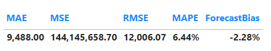

# Time-Series-Forecasting
## Objective 
The objective of this project is to forecast passangers screening for rest of the year in 2024 i.e from August to December at eight major Canadian Airports. Data for training and testing is for the past two years published weekly by https://www.catsa-acsta.gc.ca/en/screened-passenger-data

## Tech Stack
- Python(Pandas, Numpy , Sci-kit Learn, Statsmodel , Prophet)
- Power BI and DAX (for visualization)

## Models used for forecasting
- ARIMA and SARIMA
- Exponential Smoothening
- Prophet

## Parameters evaluated for accuracy
- Mean absolute error(MAE)
- Mean Squared error (MSE)
- Root mean squared error (RMSE)
- Mean absolute percentage error (MAPE)
- Mean Forecast Error (MFE)
- Mean Bias Percentage 

## Results and Analysis
- **Arima / Sarima**
Despite data being stationary results were not satisfactory as suggested by the parameters (refer file [here](https://github.com/RimpleDabas/Time-Series-Forecasting/blob/main/ARIMA_SARIMAX.ipynb)) 
- **Exponential Smoothening**

  - MAE and RMSE: Both metrics are relatively large, indicating significant errors in absolute terms. The RMSE being larger than MAE is expected because RMSE penalizes larger errors more.

- MAPE: A MAPE of 9.37% suggests moderate accuracy in percentage terms. This means that, on average, the forecasted values are off by about 9.37% from the actual values.

- MFE and Forecast Bias Percentage: The positive MFE and a forecast bias percentage of 8.798% indicate that the model tends to underestimate the actual values by nearly 8.8%. This is a systematic bias that might need correction.
- Model Performance:
The model has a moderate level of accuracy with a noticeable systematic underestimation bias. The relatively high MAE and RMSE suggest that the errors are significant, which could be problematic depending on the application.
- **Prophet**

 - MAE and RMSE 
 Both the MAE and RMSE are relatively large, indicating that the forecast errors are significant in absolute terms.
RMSE being larger than MAE is typical because RMSE penalizes larger errors more due to squaring the errors.
 - MAPE :A MAPE of 5.57% is relatively low, suggesting that the forecasts are, on average, quite close to the actual values in percentage terms. This indicates a reasonably good model performance.
Considerations  : Scale of the Data,The actual values are very large ( hundreds of thousands), an MAE of 7044.58 and an RMSE of 8575.27 can be considered relatively small.
 -Accuracy : The very low forecast bias percentage (0.296%) indicates that the model is highly accurate in its predictions on average. The systematic error is almost negligible.
- Underestimation : Since the MFE is positive, it indicates a slight underestimation in the forecasts. However, given the small magnitude of the MFE relative to the mean of the actual values, this underestimation is minimal and likely not a cause for concern.
* Reliability: The model appears to be reliable, as it does not consistently overestimate or underestimate the actual values significantly.

